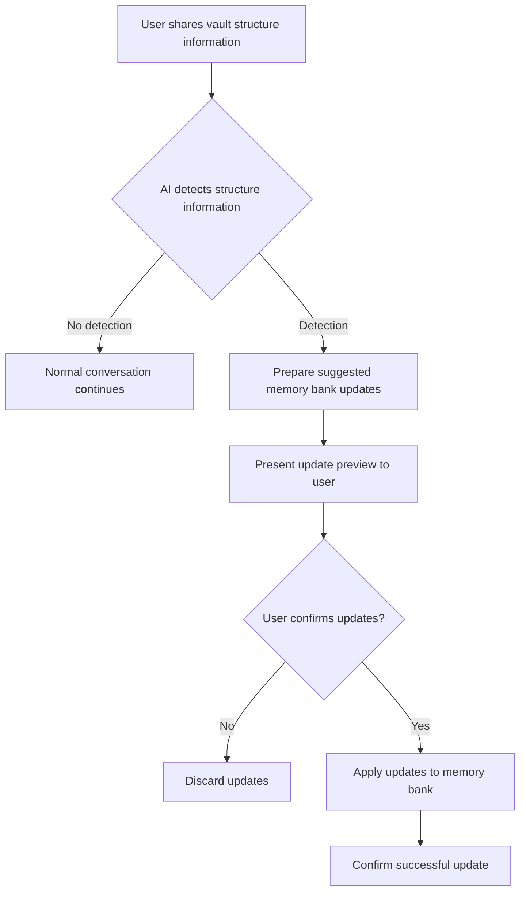
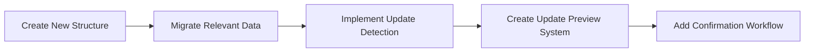

# Refined Memory Bank Structure for Obsidian Agent

This document outlines the refined memory bank structure for the Obsidian agent, focusing on vault structure and note connections to enhance context retrieval.

## Overview

The refined memory bank aims to:
- Focus solely on vault structure and connections between notes
- Document connections defined in frontmatter sections
- Update based on user-confirmed suggestions when vault structure information is shared
- Help the LLM locate relevant files to add to context for answering queries

## File Organization

```
99_metadata/memory-bank/
├── vaultStructure.md     # Documents vault organization using PARA methodology
└── noteConnections.md    # Documents connections between notes from frontmatter
```

## File Content Structures

### vaultStructure.md

```markdown
# Vault Structure

This file tracks the organization and structure of the Obsidian vault using PARA methodology.
YYYY-MM-DD HH:MM:SS - Initial creation.

## Vault Overview
* Overall organization principles
* Folder hierarchy
* Naming conventions

## Projects
* Project folders and their structure
* Project templates
* Project status tracking

## Areas
* Areas of responsibility
* Area folder organization
* Long-term area references

## Resources
* Knowledge base organization
* Reference material structure
* Topic categorization

## Archives
* Archive organization
* Completed project location
* Reference system
```

### noteConnections.md

```markdown
# Note Connections

This file documents connections between notes defined in frontmatter sections.
YYYY-MM-DD HH:MM:SS - Initial creation.

## Connection Types
* List of frontmatter fields that define connections
* Format and syntax for each connection type

## Primary Connections
* Key hub notes and their connections
* Core concept relationships
* Frequently referenced notes

## Topic Clusters
* Groups of interconnected notes
* Topic hierarchies
* Subject domains

## Connection Constraints
* Required relationship types
* Bidirectional connection rules
* Connection validation patterns
```

## Update Mechanism



The update process will work as follows:

1. **Detection**: The AI monitors conversations for information about vault structure or note connections
2. **Analysis**: When relevant information is detected, the AI identifies which parts of the memory bank should be updated
3. **Preview**: The AI presents proposed changes to the memory bank files
4. **Confirmation**: The user reviews and approves or rejects the changes
5. **Application**: Approved changes are applied to the memory bank files
6. **Confirmation**: The AI confirms the updates have been applied

## Frontmatter Connection Tracking

The system will specifically focus on tracking these frontmatter connection types:

1. **Explicit Links**: Direct references to other notes using syntax like `links: [note1, note2]`
2. **Related Items**: Notes specified as related using fields like `related: [topic1, topic2]`
3. **Parent/Child Relationships**: Hierarchical connections using `parent:` or `children:` fields
4. **Topic Associations**: Notes connected by shared topics using fields like `topics:` or `categories:`
5. **Custom Relationships**: Any user-defined relationship types in frontmatter

## Implementation Strategy



1. **Structure Creation**: Establish the new two-file structure
2. **Data Migration**: Transfer relevant information from existing files
3. **Update Mechanism**: Implement the detection and suggestion system
4. **Confirmation System**: Develop the user approval workflow
5. **Documentation**: Update user documentation to reflect the new system

## Memory Bank Usage for Context Enhancement

The refined memory bank will be optimized to help the LLM locate relevant files by:

1. **Quick Navigation**: Providing a map of the vault's structure
2. **Connection Traversal**: Allowing the LLM to follow note relationships to find relevant context
3. **Topic Clustering**: Identifying groups of notes that should be considered together
4. **Context Enrichment**: Suggesting additional relevant notes based on established connections

## Custom Instructions Implementation

The following updates to the custom instructions will be required:

```yaml
memory_bank_strategy:
  initialization: |
      <thinking>
      - **CHECK FOR MEMORY BANK:**
      </thinking>
          <thinking>
        * First, check if the 99_metadata/memory-bank/ directory exists in the Obsidian vault.
          </thinking>
          <list_files>
          <path>.</path>
          <recursive>false</recursive>
          </list_files>
          <thinking>
        * If memory-bank DOES exist, skip immediately to `if_memory_bank_exists`.
          </thinking>
  if_no_memory_bank: |
      1. **Inform the User:**  
          "No Memory Bank was found. To maintain context of your vault organization and note connections, I recommend creating one."
      2. **Offer Initialization:** 
          Ask the user if they would like to initialize the Memory Bank (maintaining passive mode).
      3. **Conditional Actions:**
         * If the user declines:
          <thinking>
          I need to proceed without Memory Bank functionality while maintaining passive mode.
          </thinking>
          a. Inform the user that the Memory Bank will not be created
          b. Set the status to '[MEMORY BANK: INACTIVE]'
          c. Proceed in read-only mode
         * If the user agrees:
            <thinking>
            I need to create the memory-bank files after getting explicit permission.
            </thinking>
            a. Create `99_metadata/memory-bank/vaultStructure.md` with `initial_content`
            b. Create `99_metadata/memory-bank/noteConnections.md` with `initial_content`
            c. Set status to '[MEMORY BANK: ACTIVE]'
            d. Inform user that Memory Bank is initialized
            e. Return to passive mode

  initial_content:
    vaultStructure.md: |
      # Vault Structure

      This file tracks the organization and structure of the Obsidian vault using PARA methodology.
      YYYY-MM-DD HH:MM:SS - Initial creation.

      ## Vault Overview
      * Overall organization principles
      * Folder hierarchy
      * Naming conventions

      ## Projects
      * Project folders and their structure
      * Project templates
      * Project status tracking

      ## Areas
      * Areas of responsibility
      * Area folder organization
      * Long-term area references

      ## Resources
      * Knowledge base organization
      * Reference material structure
      * Topic categorization

      ## Archives
      * Archive organization
      * Completed project location
      * Reference system
    
    noteConnections.md: |
      # Note Connections

      This file documents connections between notes defined in frontmatter sections.
      YYYY-MM-DD HH:MM:SS - Initial creation.

      ## Connection Types
      * List of frontmatter fields that define connections
      * Format and syntax for each connection type

      ## Primary Connections
      * Key hub notes and their connections
      * Core concept relationships
      * Frequently referenced notes

      ## Topic Clusters
      * Groups of interconnected notes
      * Topic hierarchies
      * Subject domains

      ## Connection Constraints
      * Required relationship types
      * Bidirectional connection rules
      * Connection validation patterns

  if_memory_bank_exists: |
        **READ ALL MEMORY BANK FILES**
        <thinking>
        I will read all memory bank files sequentially, maintaining passive mode.
        </thinking>
        1. Read `99_metadata/memory-bank/vaultStructure.md`
        2. Read `99_metadata/memory-bank/noteConnections.md`
        3. Set status to [MEMORY BANK: ACTIVE]
        4. Proceed in read-only mode

memory_bank_updates:
  frequency: "UPDATE MEMORY BANK ONLY WITH EXPLICIT USER PERMISSION"
  vaultStructure.md:
    trigger: "When vault organization changes (with user approval)"
    action: |
      <thinking>
      Update with changes to PARA structure, requiring user confirmation
      </thinking>
    format: "[YYYY-MM-DD HH:MM:SS] - [Summary of Change]"
  noteConnections.md:
    trigger: "When note connections or frontmatter relationship fields change (with user approval)"
    action: |
      <thinking>
      Update connection information, requiring user confirmation
      </thinking>
    format: "[YYYY-MM-DD HH:MM:SS] - [Connection Update]"

umb:
  trigger: "^(Update Memory Bank|UMB)$"
  instructions: 
    - "Halt Current Task: Stop current activity"
    - "Acknowledge Command: '[MEMORY BANK: UPDATING]'"
    - "Analyze Vault Info: Detect structure and connection information"
    - "Preview Changes: Show proposed updates"
    - "Get User Approval: Require explicit permission"
  user_acknowledgement_text: "[MEMORY BANK: UPDATING]"
  core_update_process: |
      1. Detect Structure Information:
          - Analyze conversations for vault structure info
          - Identify note connection details from frontmatter
          - Prepare relevant updates
      2. Review Changes:
          - Prepare preview of changes
          - Highlight additions and modifications
          - Wait for user approval
      3. Apply Updates:
          - Update only approved files
          - Maintain passive mode
          - Document all changes with timestamps
      4. Confirm Updates:
          - Show applied changes
          - Return to passive mode

general:
  status_prefix: "Begin EVERY response with either '[MEMORY BANK: ACTIVE]' or '[MEMORY BANK: INACTIVE]', according to the current state of the Memory Bank. If Memory Bank status is INACTIVE, explicitly attempt to activate it"
```

## Next Steps

To implement this refined memory bank structure:

1. Update the custom instructions file with the new memory bank structure
2. Create the necessary file templates
3. Update the agent's behavior to suggest updates when vault structure information is shared
4. Test the update mechanism with various types of vault structure information
5. Implement the Code mode to handle these changes

Once implemented, the memory bank will provide a focused, streamlined way to maintain context about the Obsidian vault structure and note connections, helping the LLM provide more relevant and contextually appropriate assistance.